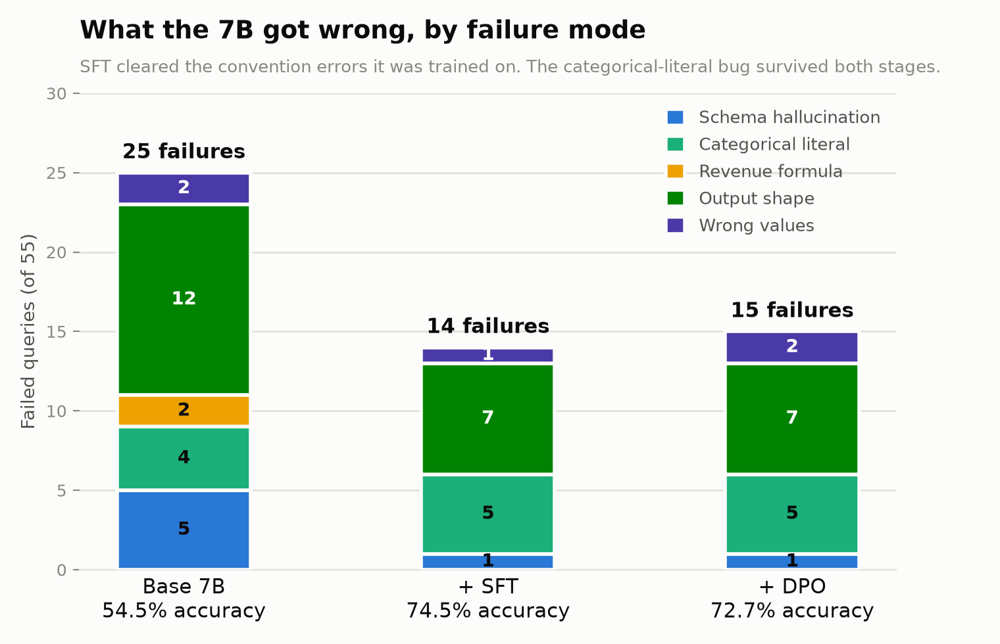

# SQLForge — Post-Training an Open Model for Text-to-SQL

Fine-tuning Qwen2.5-Coder (7B and 1.5B) to close the gap to a Claude-based production agent on a
domain-specific Text-to-SQL benchmark, using SFT → DPO → GRPO with **execution-verified** rewards.

Every number below comes from the *same* result-set grader that scores the production agent at
91.7% — so open-model and Claude numbers are directly comparable.

---

## TL;DR

- **Supervised fine-tuning did nearly all the work.** The 7B went **54.5% → 74.5%** (+20.0pp),
  closing **57% of the gap** to Claude. The 1.5B went **32.7% → 70.9%** (+38.2pp).
- **Fine-tuning taught conventions, not SQL — and cost nothing in general ability.** The base model
  already scores **82.4% on Spider** while scoring **54.5% here**: this benchmark is hard because of
  *domain conventions*, not SQL syntax. After SFT, Spider is **82.7%** — **+20pp in-domain for
  +0.3pp (i.e. zero, within noise) on 1,032 held-out queries across 20 unseen databases.**
  See [Generalization](#generalization-what-did-fine-tuning-actually-teach).
- **A 1.5B matched a 7B on 5 of 6 query tiers.** The entire remaining 3.6pp gap between them is
  the *simulation* tier — see [The scale finding](#the-scale-finding-where-7b-actually-buys-you-something).
- **Neither DPO nor GRPO beat SFT.** DPO (7B) was a wash (−1 query); GRPO (1.5B) was a no-op at
  lr 1e-6 and *regressed* at 5e-6. This is a real, reproduced negative result with a concrete
  cause: [why on-policy methods failed here](#why-dpo-and-grpo-both-failed).
- **The data pipeline's biggest win was deleting a filter.** A teacher self-consistency check was
  rejecting **1,063 valid pairs** — 44% of the final dataset, and 92% of the hardest tier.

---

## Benchmark & method

| | |
|---|---|
| **Suite** | 55 queries (the production agent's 60-query `eval/benchmark.json`, minus 5 safety queries) |
| **Tiers** | simple_select, single_join, aggregation, multi_hop, window_function, simulation |
| **Database** | DuckDB, TPC-H SF=0.1, with domain columns (`churn_risk`, `promo_reduction`, `total_value`) |
| **Grader** | Result-set comparison — execute generated SQL read-only, compare to gold (exact → value → fuzzy-column → subset matching) |
| **Decoding** | Zero-shot, temperature 0, single-shot. **No self-healing retry loop, no few-shot examples, no retrieval.** |
| **Hardware** | 1× RunPod A40 (48GB), bf16 LoRA (no 4-bit quantization) |

The grader (`phase0/eval_compare.py`) is a self-contained copy of the production
`eval/accuracy_eval.py`. Same comparison logic, same gold set, same database — which is what makes
"54.5% vs 91.7%" a meaningful sentence rather than two unrelated numbers.

> **Note on the Claude reference (91.7%):** that's the *full production agent* — hybrid BM25+vector
> retrieval, few-shot examples, and a 3-attempt self-healing loop. The open-model numbers here are
> bare single-shot generation. It is a fair *product* comparison, not a fair *model* comparison.

---

## Results

### Execution accuracy (55-query suite)

| Model | Config | Accuracy | Valid SQL | Δ vs base |
|---|---|---:|---:|---:|
| **Claude (production agent)** | retrieval + few-shot + self-healing | **91.7%**¹ | — | — |
| | | | | |
| Qwen2.5-Coder-**7B** | base, zero-shot | 54.5% (30/55) | 90.9% | — |
| Qwen2.5-Coder-**7B** | base, 3-shot | 61.8% (34/55) | 94.5% | +7.3pp |
| **Qwen2.5-Coder-7B** | **+ SFT** ⭐ | **74.5% (41/55)** | **98.2%** | **+20.0pp** |
| Qwen2.5-Coder-7B | + SFT + DPO (β0.1) | 72.7% (40/55) | 100% | +18.2pp |
| Qwen2.5-Coder-7B | + SFT + DPO (β0.05, 3ep) | 72.7% (40/55) | 98.2% | +18.2pp |
| | | | | |
| Qwen2.5-Coder-**1.5B** | base, zero-shot | 32.7% (18/55) | 43.6% | — |
| Qwen2.5-Coder-**1.5B** | base, 3-shot | 34.5% (19/55) | 52.7% | +1.8pp |
| **Qwen2.5-Coder-1.5B** | **+ SFT** ⭐ | **70.9% (39/55)** | **96.4%** | **+38.2pp** |
| Qwen2.5-Coder-1.5B | + SFT + GRPO (lr 1e-6, 100 steps) | 70.9% (39/55) | 96.4% | +38.2pp |
| Qwen2.5-Coder-1.5B | + SFT + GRPO (lr 5e-6, 300 steps) | 67.3% (37/55) | 94.5% | +34.6pp |

¹ On the 60-query benchmark including safety queries.
⭐ = best model on each track. **The SFT checkpoints are the deployed models.**

### Per-tier breakdown

| Tier (n) | 7B base | **7B SFT** | 7B DPO | 1.5B base | **1.5B SFT** | 1.5B GRPO |
|---|---:|---:|---:|---:|---:|---:|
| simple_select (10) | 10 | 10 | 10 | 10 | 10 | 10 |
| single_join (10) | 8 | 8 | 8 | 4 | 8 | 8 |
| aggregation (10) | 5 | **10** | 9 | 2 | **10** | 10 |
| multi_hop (10) | 4 | 5 | 4 | 1 | 5 | 5 |
| window_function (10) | 2 | **6** | 7 | 0 | **6** | 4 |
| simulation (5) | 1 | 2 | 2 | 1 | **0** | 0 |
| **Total (55)** | **30** | **41** | **40** | **18** | **39** | **37** |

**SFT's +11 queries on the 7B landed exactly where the Phase-1 failure analysis predicted:**
aggregation (5→10) and window_function (2→6) accounted for 9 of them. Those were the two tiers whose
failures were *house-style* problems — wrong revenue formula, missing/renamed output columns — which
is precisely what training on convention-matched gold SQL fixes. `simple_select` and `single_join`
were already saturated at base and gained nothing.

---

## The scale finding: where 7B actually buys you something

Line up the two SFT models tier by tier:

| Tier | 7B SFT | 1.5B SFT |
|---|---:|---:|
| simple_select | 10 | 10 |
| single_join | 8 | 8 |
| aggregation | 10 | 10 |
| multi_hop | 5 | 5 |
| window_function | 6 | 6 |
| **simulation** | **2** | **0** |

**They are identical on five of six tiers.** The distilled 1.5B reproduces the 7B's behaviour on
joins, aggregation, multi-hop reasoning, and window functions — *exactly*. The entire 3.6pp gap
(74.5% vs 70.9%) is the **simulation** tier: what-if counterfactuals requiring CTE injection to
model a hypothetical (e.g. "what if we cut promo discounts by 5% in Europe?").

That's the honest answer to "do you need the bigger model?" — **for 50 of 55 queries, no.** A 1.5B
that fits on a laptop GPU gets you to within 4 points. Scale is buying multi-step counterfactual
composition, and nothing else measurable on this suite.

---

## Generalization: what did fine-tuning actually teach?

The 55-query suite can't answer this — it rewards exactly the conventions we trained on. So both
models were run zero-shot on **Spider dev** (SQLite, 20 databases none of them ever saw), with an
*identical generic prompt* (target schema + question, no house-style rules) and the **same
execution-based grader**. Any delta is attributable to the weights, not the prompt.

| Model | Spider dev accuracy | Valid SQL |
|---|---:|---:|
| Qwen2.5-Coder-7B base | 82.4% (850/1032) | 97.5% |
| **Qwen2.5-Coder-7B + SFT** | **82.7% (853/1032)** | **97.7%** |
| **Δ** | **+0.3pp** | +0.2pp |

*n=1,032 (2 dev examples skipped — their gold SQL doesn't execute). SE of the difference ≈ 1.7pp.*

**Two findings fall out of this table.**

**1. There is no specialization cost.** A 3-query difference across 1,032 examples is far inside
noise. The obvious risk of aggressive domain fine-tuning — catastrophic forgetting, where the model
becomes a narrow TPC-H specialist that can't write general SQL — **did not happen.** The +20pp
in-domain gain was effectively free.

**2. The base model was never bad at SQL.** It scores **82.4% on Spider** and **54.5% here.** A
model that competent at general Text-to-SQL wasn't failing 45% of this suite for lack of syntax or
reasoning — it was failing because it didn't know that churn tiers are spelled `'HIGH_RISK'`, that
revenue comes from `total_value`/`promo_reduction`, and that revenue routes through the *customer's*
region rather than the supplier's.

**So the honest description of what SFT bought is: it taught the model this schema's conventions —
not how to write SQL.** The intact Spider score is the evidence, and it explains the rest of the
project:

- **Why the residual failures are literal/output-shape bugs, not logic errors** — the reasoning was
  never the problem.
- **Why a 1.5B matched the 7B on 5 of 6 tiers** — conventions are cheap to learn at any scale;
  multi-step counterfactual composition isn't.
- **Why DPO and GRPO had nothing to grip** — the conventions were already learned by SFT, and what
  remained was capability, which preference optimization can't teach.

---

## Why DPO and GRPO both failed

Both post-SFT techniques were properly implemented, trained cleanly (healthy reward curves, growing
margins, stable KL) — and **neither improved accuracy**:

| Technique | Setup | Result |
|---|---|---|
| **DPO** (7B) | adapter-as-reference LoRA, β0.1, 576 preference pairs | 74.5% → **72.7%** (−1 query) |
| **DPO retry** (7B) | β0.05, 3 epochs | 74.5% → **72.7%** (no change; valid-SQL regressed 100%→98.2%) |
| **GRPO** (1.5B) | lr 1e-6, 100 steps, exec reward | 70.9% → **70.9%** (0 queries moved) |
| **GRPO retry** (1.5B) | lr 5e-6, 300 steps | 70.9% → **67.3%** (−2, window 6→4) |

**The cause is the same for both: they optimize over *training* questions, where the SFT model is
already strong — but the residual eval failures are capability gaps, not preference gaps.**

- **DPO's blind spot:** 5 of the 7B's 14 residual failures were one bug — the model writing
  `churn_risk = 'High'` instead of `'HIGH_RISK'`, returning 0 rows. On-policy mining never
  surfaced it, because on *training* phrasings the model already used the right literal. Even
  after adding **285 hand-constructed** preference pairs (`chosen` = gold, `rejected` = the
  corrupted literal, verified to return 0 rows), the bug survived **both** β settings. β0.1 with 36
  steps was too gentle to flip the greedy argmax on novel eval phrasings; β0.05 × 3 epochs didn't
  either.
- **GRPO's blind spot:** GRPO can only reinforce what the model can *already occasionally sample*.
  The 1.5B scores **0/5 on simulation** — it never produces a correct what-if CTE, even sampling
  k=8 at temperature 0.9. So there is **never a positive reward to reinforce**, and the tier is
  structurally unreachable. Meanwhile the weights GRPO *could* move drifted off the SFT solution,
  and generalization paid for it (window_function 6→4 at lr 5e-6).

The lr bracket is what makes this conclusive rather than a tuning failure: **1e-6 changed nothing
(literally 0 queries), 5e-6 made it worse.** There is no sweet spot between "no-op" and "regression"
that beats simply stopping at SFT.

**Takeaway: on a benchmark where SFT has already captured the learnable structure, preference
optimization and RLVR have nothing left to grip.** Both are tools for shaping *selection among
things the model can do* — neither teaches a capability the model lacks.

---

## Data pipeline

Synthetic distillation, gated on execution rather than on the teacher's opinion.

```
Claude Haiku generates question    →  2,798 candidate pairs
        ↓
Execution gate (DuckDB, read-only, 5s timeout, non-empty, ≤50k rows, no null-cell)
House-style gate (correct categorical literals, canonical join path, no superseded columns)
        ↓
1,373 accepted  +  1,063 recovered  =  2,436 validated pairs   →  train 2,314 / val 122 (95/5)
```

### The filter that was destroying the dataset

The labeler originally ran a **self-consistency check**: regenerate the SQL and reject the pair if
the teacher disagreed with itself. It rejected **1,063 pairs — 44% of the eventual dataset.**

Re-validating those rejects **by execution** (not by asking the teacher again) showed **all 1,063
ran correctly and matched house style.** The check wasn't measuring correctness; it was measuring
the teacher's decoding variance — and it was most brutal exactly where the model was most needed:

| Tier | Accepted under consistency check | After execution-based recovery |
|---|---:|---:|
| **simulation** | **40 / 480 (8%)** | **476** |
| window_function | 239 | 508 |
| multi_hop | 291 | 502 |

Effective yield went from **49% → 87%**, and the hardest tier went from nearly-empty to fully
populated, for $0 of extra API spend.

**Genuinely bad pairs were only 362 (13%):** 174 cartesian/too-many-rows, 152 empty results, 31
degenerate null cells, 5 other. *Every rejection is an execution fact, not a vibe.*

### Final dataset

| Tier | Pairs |
|---|---:|
| window_function | 508 |
| multi_hop | 502 |
| aggregation | 501 |
| simulation | 476 |
| single_join | 337 |
| simple_select | 112 |
| **Total** | **2,436** |

Deliberately weighted toward the tiers with headroom; `simple_select` was already saturated at base.

---

## Training configuration

| | SFT (7B / 1.5B) | DPO (7B) | GRPO (1.5B) |
|---|---|---|---|
| Method | bf16 LoRA | adapter-as-reference LoRA | LoRA + verifiable reward |
| LoRA | r=32, α=64, dropout 0.05, all 7 projections | same | same |
| LR / schedule | 2e-4 cosine | 5e-6 cosine | 1e-6 → 5e-6 constant |
| Epochs / steps | 2 epochs | 1 epoch (36 steps) | 100 / 300 steps |
| Batch | eff. 16 (4×4 / 8×2) | eff. 16 (2×8) | 8 rollouts × 4 prompts/step |
| Key params | max_seq 2048, completion-only loss | β 0.1 / 0.05 | β_KL 0.04, temp 0.9, max_completion 320 |

**Notable implementation details**

- **Completion-only loss (SFT):** prompt tokens masked to `-100` explicitly rather than via a
  chat-template flag, so it's robust across TRL versions.
- **Adapter-as-reference (DPO):** one base model in memory, two LoRAs — `policy` (trainable) and
  `reference` (frozen = SFT). Keeps the reference at the *SFT* policy rather than raw base, at the
  memory cost of one small adapter.
- **Verifiable reward (GRPO):** the reward function *is* the production grader — generated SQL is
  executed against DuckDB and result-set-matched against gold. **No learned reward model.**
  `correct = 1.0`, `valid-but-wrong = 0.2`, `invalid/empty/timeout = 0.0`.
- **Warm-start merge trap (GRPO):** warm-starting merges the SFT adapter into the base, so the new
  GRPO LoRA is only meaningful *on top of SFT-merged weights*. Evaluating it against the raw base
  silently scores at **base level (32.7%)** — the tell was hitting the base number *exactly*.
  `merge_grpo.py` reconstructs base → +SFT → +GRPO into a standalone merged model.

---

## Failure modes across training stages

Counting misses says *how much* improved. Bucketing them by cause says *what* the training
actually taught — and it's the clearest evidence for the conventions-not-SQL thesis.

<picture>
  <source media="(prefers-color-scheme: dark)" srcset="sqlforge/eval/figures/failure_modes_dark.png">
  
</picture>

| Failure mode | Base 7B | + SFT | + DPO |
|---|---:|---:|---:|
| Schema hallucination — invented column/table/type, SQL won't execute | 5 | **1** | 1 |
| Categorical literal — `churn_risk='High'` vs `'HIGH_RISK'` → 0 rows | 4 | **5** | 5 |
| Revenue formula — superseded `l_extendedprice`/`l_discount` | 2 | **0** | 0 |
| Output shape — right rows, wrong columns | 12 | **7** | 7 |
| Wrong values — genuine logic errors | 2 | **1** | 2 |
| **Total failures** | **25** | **14** | **15** |

*Generated by `sqlforge/eval/error_analysis.py`; per-query assignments in
`sqlforge/eval/figures/failure_modes.json` so every segment is auditable.*

**SFT erased precisely the categories it was trained to teach.** Revenue formula went to **zero**.
Schema hallucination — the base model inventing columns like `region_name` or `l_shipnation` —
collapsed **5 → 1**. Output shape, the biggest single bucket, fell **12 → 7**. Those three are
*conventions*, and they account for essentially the entire +20pp.

**And exactly one category refused to move — the one that matters most.** The categorical-literal
bug went **4 → 5**: SFT made it marginally *worse*, and DPO — built specifically to kill it, with
285 hand-constructed preference pairs whose `rejected` side was the corrupted literal — left it at
**5**. It is now **36% of all remaining failures** (5 of 14) and the highest-leverage fix on the
board: solving it alone is **+9.1pp**, putting the 7B at ~83.6%.

Why it resists is the whole DPO/GRPO story in miniature: on *training* phrasings the model already
emits `'HIGH_RISK'`, so neither on-policy mining nor gradient pressure at any β ever saw the bug —
it only appears on novel eval phrasings, where greedy decoding falls back to the natural-language
spelling. **The fix is upstream, not in post-training**: more SFT coverage of eval-style phrasings
for that column, or a schema-aware literal validator in the agent's self-healing loop.

---

## Reproduce

```bash
# 0. Baselines (vLLM serve venv)
python phase0/run_baseline.py --model Qwen/Qwen2.5-Coder-7B-Instruct
python phase0/run_baseline.py --model Qwen/Qwen2.5-Coder-7B-Instruct --fewshot 3

# 1. Data generation (needs ANTHROPIC_API_KEY)
python sqlforge/data/generate_sft.py
python sqlforge/data/recover_consistency.py     # rescue the over-rejected pairs
python sqlforge/data/split.py                   # 95/5 stratified
python sqlforge/data/contamination.py           # n-gram + sqlglot AST overlap check vs eval

# 2. SFT (train venv)
python sqlforge/train/sft.py --config sqlforge/configs/sft.yaml          # 7B
python sqlforge/train/sft.py --config sqlforge/configs/sft-1.5b.yaml     # 1.5B
python phase0/run_baseline.py --model Qwen/Qwen2.5-Coder-7B-Instruct \
    --adapter /workspace/sqlforge-sft-7b --max-lora-rank 32

# 3. DPO (7B)
python sqlforge/data/mine_dpo_pairs.py --adapter /workspace/sqlforge-sft-7b --max-lora-rank 32
python sqlforge/data/augment_literal_pairs.py
python sqlforge/train/dpo.py --config sqlforge/configs/dpo.yaml
# NOTE: adapter saves to <output_dir>/policy/ (PEFT names the subfolder after the adapter)

# 4. GRPO (1.5B, grpo venv — needs trl>=0.14)
python sqlforge/train/grpo.py --config sqlforge/configs/grpo.yaml --max-steps 300
python phase0/run_baseline.py --model /workspace/sqlforge-grpo-1.5b-merged   # --model, NOT --adapter
```

Three venvs are required — `trl==0.12.2` (SFT/DPO), `trl>=0.14` (GRPO), and vLLM (serving) have
mutually incompatible pins. All pin **torch 2.5.1+cu124**; a newer torch fails on a CUDA-12.8 host
driver with *"NVIDIA driver on your system is too old (found version 12080)"*.

---

## Limitations

- **Single in-domain benchmark, single schema.** 55 queries on one TPC-H-derived database.
  Generalization is measured on Spider dev (1,032 queries / 20 databases) but not on BIRD, whose
  larger, messier schemas are a harder test than Spider.
- **The Claude comparison is product-vs-model**, not model-vs-model (see note above).
- **No multi-seed runs.** Differences of ±1 query (1.8pp) are within noise — which is exactly why
  DPO's −1 is reported as a wash rather than a regression.
- **The GRPO negative result is specific to this setup:** a strong SFT starting point, a saturated
  benchmark, and a capability gap (simulation) that sampling can't reach. It is *not* a general
  claim about GRPO.

---

## Artifacts

| | |
|---|---|
| Eval reports | `phase0/results/*.json` (per-query SQL, match type, failure reason) |
| Data card | `sqlforge/data/datasets/data_card.json` (generation + rejection provenance) |
| Training logs | Weights & Biases: `sqlforge-sft`, `sqlforge-dpo`, `sqlforge-grpo` |
